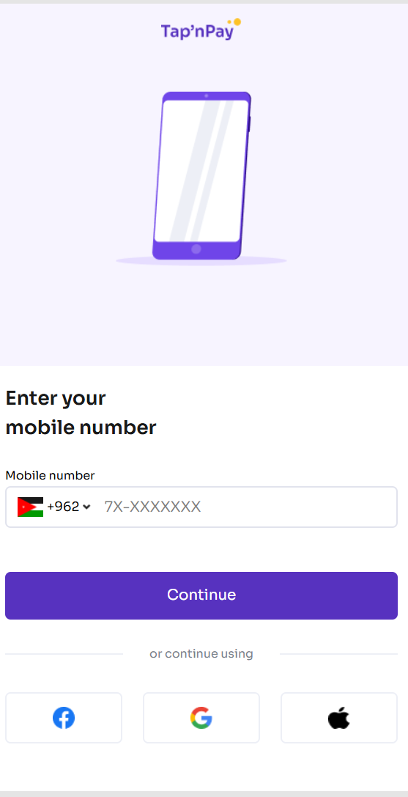

# Project Name

## 📌 Project Overview

This project is a frontend case challenge built to demonstrate clean architecture, scalability, and best practices in modern frontend development. The application focuses on delivering a responsive, maintainable, and user-friendly experience while meeting all functional requirements outlined in the challenge.

The goal of this project is to showcase real-world problem-solving skills, code quality, and thoughtful design decisions expected from a production-ready frontend application.

---

## ✨ Features Implemented

- User authentication
- Token-based session handling
- Protected routes for authenticated users
- Responsive design across desktop and mobile devices
- Reusable and scalable component structure
- Client-side form validation
- Clean and consistent UI design

---

## ⚙️ Setup and Installation

### Prerequisites

- Node.js (v18 or later recommended)
- npm or yarn

### Installation Steps

```bash
# Clone the repository
git clone https://github.com/your-username/project-name.git

# Navigate into the project directory
cd project-name

# Install dependencies
npm install

# Start the development server
npm run dev

## 🧰 Framework Choice & Reasoning

### Framework
**React** was chosen for this project because it provides:

- A component-based architecture that promotes reusability
- A strong ecosystem and community support
- Excellent performance and built-in optimization capabilities
- Scalability suitable for real-world, production-grade applications

### Supporting Tools
- **TypeScript** – Ensures type safety, reduces runtime errors, and improves long-term maintainability
- **Tailwind CSS** – Enables rapid UI development with consistent styling and a scalable design system
- **Context API** – Provides predictable and centralized global state management

## 🧠 Design Decisions & Trade-offs

### Design Decisions
- Adopted a modular folder structure to support scalability and maintainability
- Created reusable UI components (e.g., buttons, inputs, layouts) to reduce duplication
- Used centralized state management for handling shared and global application state

### Trade-offs
- Prioritized client-side rendering to enable faster development and easier iteration
- Limited reliance on third-party UI libraries to maintain full control over styling and design
- Focused on code clarity and long-term maintainability rather than complex animations

## 🚧 Challenges Faced & Solutions

### Authentication & Route Protection
**Challenge:** Preventing unauthorized access to protected pages.

**Solution:**
Implemented token-based authentication and wrapped protected routes with an authorization check to ensure only authenticated users can access sensitive areas.

---

### State Management
**Challenge:** Managing shared state across multiple components.

**Solution:**
Centralized global state using Context API to keep the state predictable and easy to debug.

---

### UI Consistency
**Challenge:** Maintaining consistent colors, and typography across the app.

**Solution:**
Defined a small design system using Tailwind CSS configuration and reused base UI components throughout the application.

### Links

- Live Site URL: [TapnPay](https://tapnpay.netlify.app/)

### Screenshot



```
